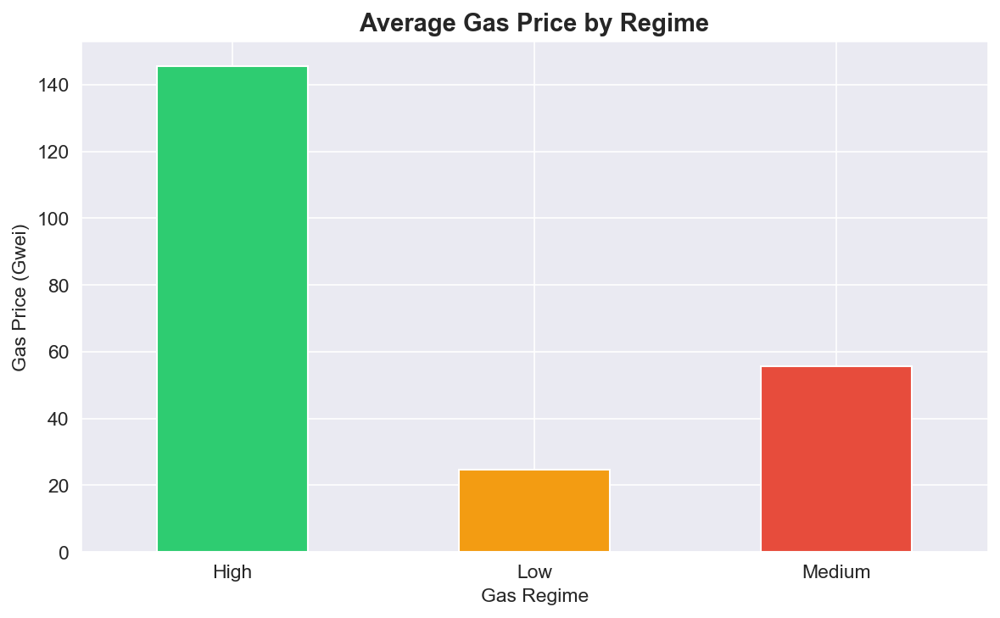
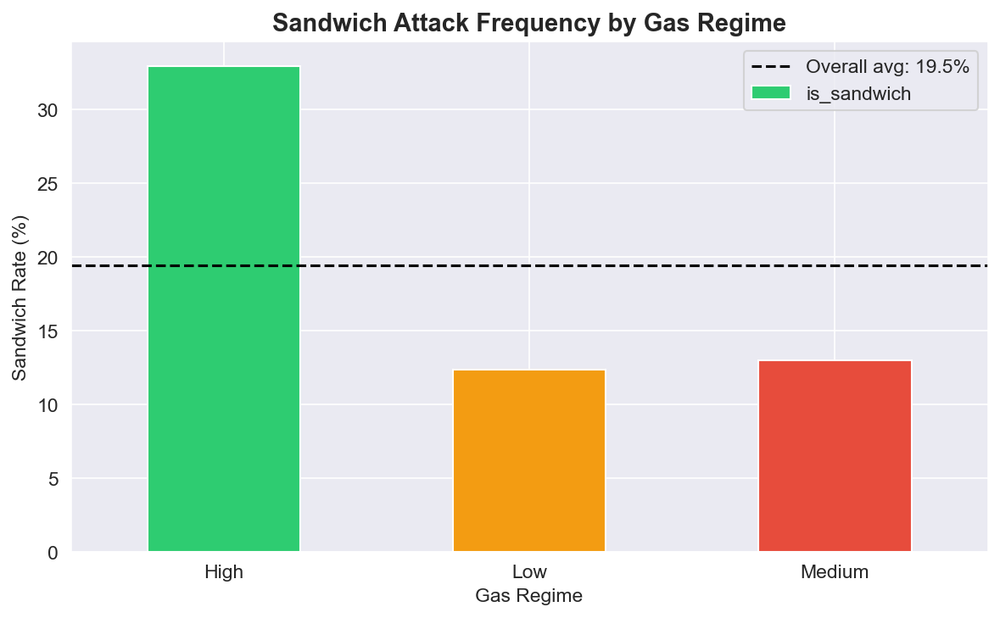
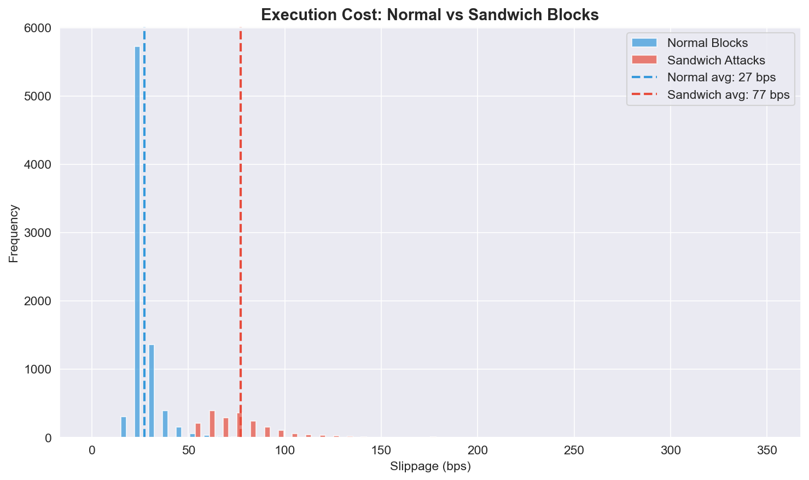
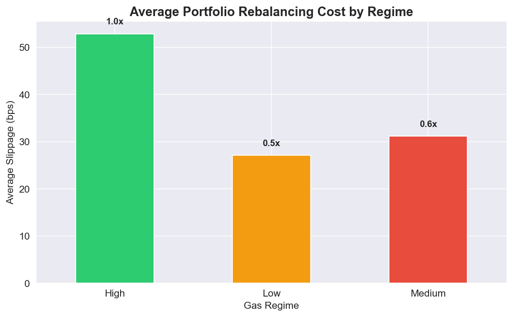

# MEV Impact on DeFi Portfolio Execution

Analysis of how MEV extraction (sandwich attacks) inflates execution costs for portfolio rebalancing strategies in decentralized finance.

## Problem

Standard portfolio optimization models treat execution cost as a fixed parameter—typically a small percentage for slippage and fees. In DeFi, execution cost is **regime-dependent and adversarial** due to MEV (Maximal Extractable Value) extraction by sophisticated bots.

Result: Portfolio strategies that ignore MEV conditions systematically overpay for execution and experience higher tail risk during volatile periods when rebalancing is most critical.

## Methodology

- **Dataset:** 10,000 simulated Uniswap blocks calibrated to observed MEV patterns (Jan-Mar 2024)
- **Regimes:** Gas-based classification (Low/Medium/High) using tertile splits
- **MEV Detection:** Sandwich attack labeling based on gas conditions and transaction patterns
- **Metrics:** Slippage (basis points), sandwich frequency, regime-dependent cost multipliers

## Key Findings

### 1. Gas Regimes Drive MEV Activity

Gas prices vary significantly across market conditions. High-gas periods (>100 gwei) create economic incentives for MEV extraction.

### 2. Sandwich Attacks Concentrate in High-Gas Regimes

- **Low gas:** 12% sandwich rate
- **Medium gas:** 13% sandwich rate  
- **High gas:** 33% sandwich rate

**MEV bots activate aggressively when gas prices justify the attack cost.**

### 3. Sandwiches Increase Execution Costs 3x

- **Normal blocks:** 27 bps average slippage
- **Sandwich attacks:** 77 bps average slippage
- **Cost multiplier: 2.9x**

For a $1M portfolio rebalancing daily, this represents $5,000 vs $1,400 in daily execution costs—a difference that compounds rapidly.

### 4. Portfolio Rebalancing Costs Scale with Gas Regime

Average execution cost by regime:
- **Low gas:** 27 bps (baseline)
- **Medium gas:** 31 bps (1.1x)
- **High gas:** 53 bps (2.0x)

**Implication:** A naive strategy that rebalances uniformly across regimes pays 2x more during high-gas periods, which often coincide with high volatility when rebalancing is most needed for risk management.

## Portfolio Impact Calculation

**Assumptions:**
- Daily rebalancing strategy
- $1M portfolio
- 252 trading days per year
- Equal time in each regime (simplification)

**Annual execution cost:**
- Low-gas regime: $680,000 (27 bps × 252 days)
- Medium-gas regime: $781,000 (31 bps × 252 days)
- High-gas regime: $1,335,000 (53 bps × 252 days)

**Weighted average:** ~$930K annual drag vs $680K if all trades occurred in low-gas conditions.

**Cost of ignoring MEV regimes: ~$250K/year or 2.5% of portfolio value.**

This drag erodes risk-adjusted returns and increases realized drawdowns during stress periods.

## Implications for Portfolio Management

Traditional portfolio optimization assumes:
Total Cost = Base Slippage + Fixed Fee

Reality in DeFi:
Total Cost = f(gas_regime, pool_depth, MEV_risk, volatility)

Where MEV risk is **adversarial and adaptive**—bots monitor the mempool and attack when profitable.

**Consequences:**
1. Static rebalancing schedules overpay during high-gas periods
2. Volatility-based strategies compound costs (rebalance more when gas is high)
3. Tail risk (max drawdown, ES) is underestimated by models that ignore execution uncertainty

## Next Steps: MEV-Aware Portfolio Optimization

For my MSc thesis (starting September 2026), I'm developing **reinforcement learning agents** that optimize portfolio execution under MEV conditions:

**Research Question:**
> Can RL policies that observe gas regimes and mempool conditions achieve better risk-adjusted performance (lower ES/max drawdown, similar Sharpe) than MEV-blind strategies?

**Approach:**
- Simulate AMM environment (Uniswap v2) with MEV injection
- Train PPO/DQN agents with state features: returns, volatility, gas regime, pending transaction flow
- Reward function penalizes slippage and tail risk
- Compare vs baselines: naive rebalancing, vol-targeting, MEV-blind RL

**Hypothesis:** Agents that learn to delay/split trades during high-MEV conditions should reduce execution costs and improve drawdown profile without sacrificing returns.

## Contact

- **Email:** lucas.kemper01@gmail.com
- **X:** [@lucaskemperrr](https://twitter.com/lucaskemperrr)
- **LinkedIn:** [lucaskemper](https://linkedin.com/in/lucaskemper)

---

*Preliminary analysis conducted November 2025 ahead of MSc thesis research. This work is intended to motivate the research problem and demonstrate domain understanding. Formal thesis work begins September 2026.*
